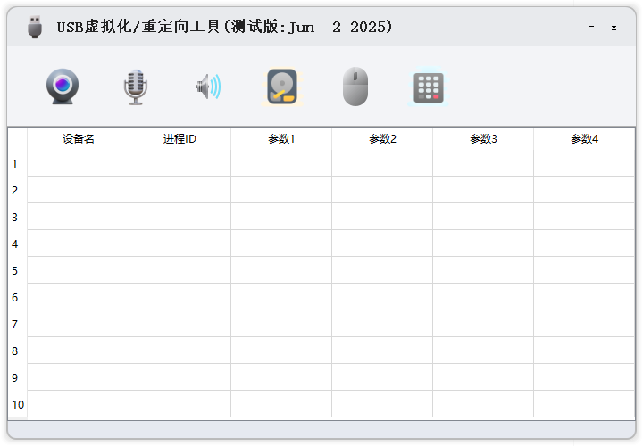
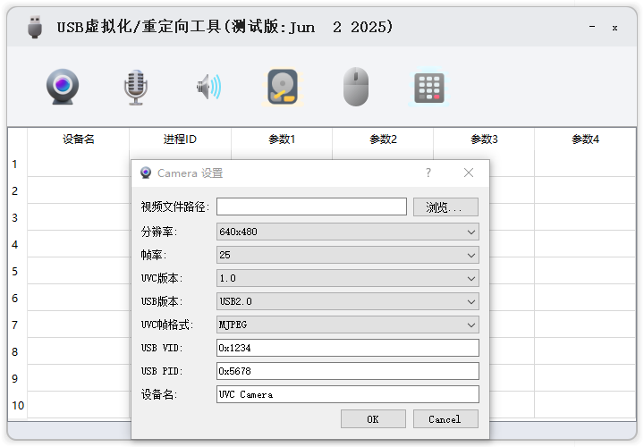
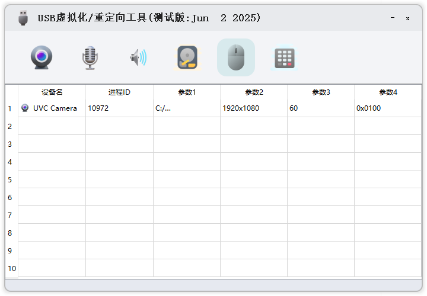
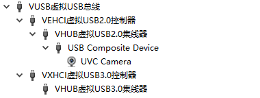

# Virtual-UVC-Camera

- 支持WIN7,WIN10等系统。
- 注意测试需要提前禁用windows驱动签名，原因是驱动未签名。具体方法请网上搜索。

-   支持"MJPEG","YUV420P", "NV12", "H264", "H265"  5种帧格式。
    MJPEG兼容性较好，支持4K，支持windows自带相机，微信，抖音直播伴侣等APP。
    H264支持高帧率大分辨率，但是很多APP不支持，仅potplayer支持较好。
-   支持自定义VID ，PID， 设备名。
-   支持自定义分辨率。
-   支持无限创建虚拟摄像头个数，取决于你的硬件资源，直到蓝屏。
-   视频编码解码支持硬件加速，目前测试通过的平台有Intel集显，nvidia 1060
-   目前仅开放UVC摄像头虚拟化，其他功能暂不开放。
-   欢迎反馈bug。

